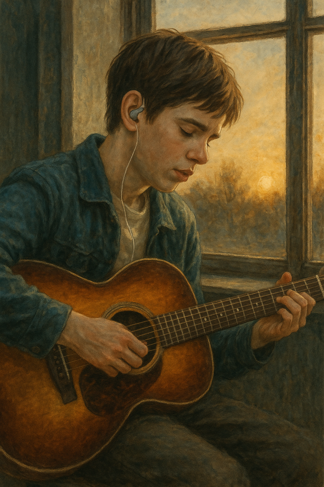

# August rush

"This Time" doesn't directly address disability, Since it is used in the symbolic scene of the journey of overcoming the psychological and environmental obstacles of the protagonist through music, it can be said to be a song that is meaningful enough to explore the relationship between disability and art. (https://www.youtube.com/watch?v=zynpXcAhq8c&ab_channel=PaulPonce) This song is a quiet confession sung by someone with a wound, opening up for the first time, and a little consolation to all deficiencies who want love.

Example: https://github.com/hskye79/medicalhumanitiesmusic/blob/main/choi_jeongin.md
There is a similarity that people with mental illness do music

장례식 배경음악 다니엘-은방울
내 장례식의 음악은 ‘슬픔’이나 ‘이별’을 위한 곡이 아닌, ‘아름다웠던 서사의 마무리’로서의 죽음을 표현하고 싶다. 죽음도 한 편의 예술로 남기고 싶은 사람이고 싶다. 이 곡은 사람들을 울게 만들되, 그 울음 끝에 묘한 따뜻함이 남아있다. "너무 슬퍼하지 마. 나는 잘 살았고, 잘 떠났고, 우리의 사랑은 끝이 아니야." 나는 죽음까지도 사랑스럽게 연출하고 싶은 예술가이고 싶다. 
‘은방울’이라는 단어 자체가 아름답고 고전적인 뉘앙스를 지녔다. 마치 한겨울 고요한 풍경 속에서 들려오는 작은 종소리처럼. 곡 전체가 이 제목에 걸맞게 차분하면서도 울림이 있다. 특히 보컬의 딕션과 호흡 하나하나에서 정제된 슬픔과 절제된 사랑이 느껴져서 더 깊이 빠져들 수밖에 없는 노래이다. 가사는 직설적인 듯하면서도 여백이 많다. 명확히 어떤 이야기라고 특정할 순 없는데, 듣는 사람의 상처나 그리움에 따라 저마다 다르게 다가오는 구조이다. 예전 누군가와의 추억을 떠올릴 수도 있고, 스쳐 지나간 인연에 대한 회한으로 들릴 수도 있고, 아니면 사랑노래일 수도,,, 그게 바로 이 곡이 가진 문학적인 매력인 것 같다. 듣다 보면 꼭 한 편의 짧은 시를 조용히 읊조리는 기분이다.
https://youtu.be/YzJW3lJeZa0?si=GaaWLPhCes3W5yvJ
